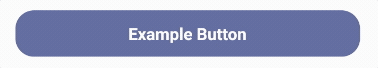
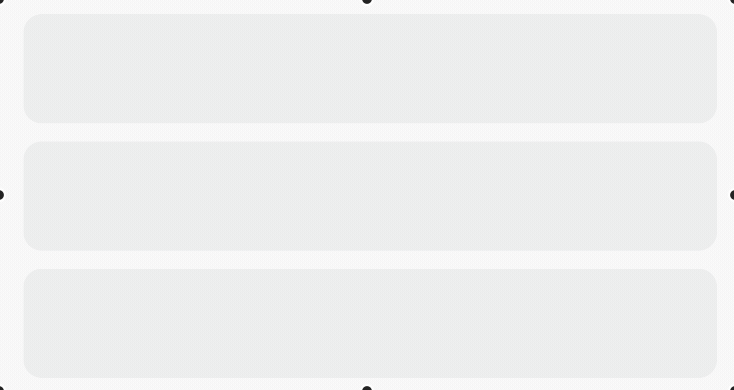

# HTD Commons

A mono repo of helpful flutter widgets and utils.

- [HTD Commons](#htd-commons)
  - [Getting started](#getting-started)
  - [Widgets](#widgets)
    - [`FadeButton`](#fadebutton)
      - [Example](#example)
    - [`Fader`](#fader)
      - [Example](#example-1)
    - [`LoadingDots`](#loadingdots)
      - [Example](#example-2)

## Getting started

If you want to add all widgets to your app, follow these steps:

1. Add this to your `pubspec.yaml` file.

    ```yaml
    dependencies:
      htdc:
        git: git://github.com/HealthTechDevelopers/flutter_commons.git
    ```
2. You are ready! 😉

## Widgets

### `FadeButton`

A widget that provides a fade effect when a tap gesture is performed on its child.

#### Example 
```dart
FadeButton(
  onPressed: () {},
  child: Container(
    alignment: Alignment.center,
    height: 50,
    padding: const EdgeInsets.all(15),
    decoration: BoxDecoration(
      borderRadius: BorderRadius.circular(20),
      color: Color(0xFF4E598C),
    ),
    child: Text(
      'Example Button',
      style: TextStyle(
        fontSize: 18,
        color: Colors.white,
        fontWeight: FontWeight.w700,
      ),
    ),
  ),
)
```


### `Fader`

A widget that provides a loop fade effect that can be used to make fake content loaders. You can use it together with `PlaceholderStripe` widget.

#### Example
```dart
Column(
  children: <Widget>[
    const PlaceholderStripe(
      height: 60,
    ),
    const SizedBox(height: 10),
    const PlaceholderStripe(
      height: 60,
    ),
    const SizedBox(height: 10),
    const PlaceholderStripe(
      height: 60,
    ),
  ],
)
```


### `LoadingDots`

A widget that provides a loop fade effect that can be used to make fake content loaders. You can use it together with `PlaceholderStripe` widget.

#### Example
```dart
Center(child: LoadingDots())
```


